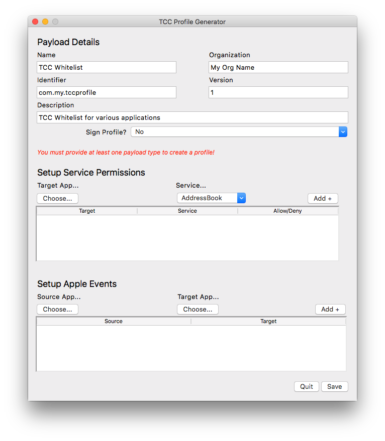

# tccprofile
Creates a mobileconfig profile for TCC configuration in a certain version of macOS.

Currently it _only_ generates payloads for _application_ binaries, and will generate the same allow settings (i.e. Allow/Deny the app control) for any apps specified.

It's recommended that whatever app or script you're creating a profile for exists on the "build" system in the same location as it exists on target systems, otherwise you will need to modify the file paths for any app/script that uses the `path` identifier instead of the `bundleID`.

In the example `AppleEvents` payload below for `outset`, I've run `tccprofile.py` against the path `/Users/carl/Desktop/git/outset/pkgroot/usr/local/outset/outset` and that is what will be in the generated profile:
```
<dict>
	<key>AEReceiverCodeRequirement</key>
	<string>identifier "com.apple.systemevents" and anchor apple</string>
	<key>AEReceiverIdentifier</key>
	<string>com.apple.systemevents</string>
	<key>AEReceiverIdentifierType</key>
	<string>bundleID</string>
	<key>Allowed</key>
	<true/>
	<key>CodeRequirement</key>
	<string>identifier "com.github.outset" and anchor apple generic and certificate leaf[subject.CN] = "Mac Developer: foo@example.org (ABC01FFFGH)" and certificate 1[field.1.2.345.678901.234.5.6.7] /* exists */</string>
	<key>Comment</key>
	<string>Allow outset to send AppleEvents control to System Events</string>
	<key>Identifier</key>
	<string>/Users/carl/Desktop/git/outset/pkgroot/usr/local/outset/outset</string>
	<key>IdentifierType</key>
	<string>path</string>
</dict>
```

After the profile is created, you would need to replace that path with the correct path of outset as it would be on a target system:
```
<key>Identifier</key>
<string>/usr/local/outset/outset</string>
```

To do this programmatically you could generate the profile with one command, and use something like `sed` to correct the file path.
```bash
./tccprofile.py --ae git/outset/pkgroot/usr/local/outset/outset,/System/Library/CoreServices/System\ Events.app --allow --pd="Outset AppleEvents TCC Whitelist"  --pi="com.github.carlashley" --pn="Outset AppleEvents Control"  --po="My Great Company" --pv=1  -o Outset_AppleEvents_TCC_Whitelist.mobileconfig
sed -i '' 's/git\/outset\/pkgroot//g' Outset_AppleEvents_TCC_Whitelist.mobileconfig
```

#### Notes:
At this time, the `StaticCode` value in a payload is not implemented in this iteration of `tccprofile.py`. For the time being, if you require this, add it to the profile manually after generating it.

The `--allow` argument is applied to _all_ payloads created by this tool with the exception of the `Camera` and `Microphone` payloads (see section below). If you do need to disable specific apps in payloads, modify the profile after generating it.

If you are uploading these profiles to JAMF, you may need to use the `--sign` argument to ensure the profile uploads correctly.

### Code Signed Scripts
This utility will check if a script has been code signed, if it has, it will default to creating a profile with the code sign requirements of the script. If the script is not code signed, it will default to the shell path or interpreter path as specified in the shebang line (i.e. `#!/usr/bin/python` or `#!/bin/sh`). This can still fail, however, if the shell or interpreter itself is not code signed. This would be applicable in scenarios where a new version of a shell or python, etc, has been installed on the system. For that reason, it's suggested that using the macOS system shells or python is best practice. Alternatively, code signing the shell/interpreter is possible.

#### Notes on Creating Profiles for Code Signed Scripts
When a "plain" text file is code signed, the code sign requirements are stored in several extended attributes, these attributes are not preserved by default when using a tool like `pkgbuild` to build a package. If you plan on distributing code signed scripts in an installer package, you will need to make sure the build tool can preserve the extended attributes.


## Camera and Microphone payloads
Per Apple's [documentation](https://developer.apple.com/enterprise/documentation/Configuration-Profile-Reference.pdf) on the Privacy payloads, `tccprofile.py` will automatically set the `Allowed` value to `False`, even if the `--allow` flag is used.

## Code Signing Requirements
The output of `codesign -dr - /Application/Application.app` is likely to vary as the developer of the app releases new versions, etc, or needs to re-sign the app for whatever reason. It will be critical to maintain an accurate profile with these correct `codesign` results, as being not specific enough can potentially lead to bad actors maliciously acting on your system.

For example, both the values below for the `CodeRequirement` of payloads for Adobe Photoshop CC 2018 will work.

Example A:

```
identifier "com.adobe.Photoshop" and anchor apple generic and certificate 1[field.1.2.840.113635.100.6.2.6] /* exists */ and certificate leaf[field.1.2.840.113635.100.6.1.13] /* exists */ and certificate leaf[subject.OU] = JQ525L2MZD
```
Example B:

```
identifier "com.adobe.Photoshop" and anchor apple generic
```

Out of these two examples, `Example B` can be considered the least secure/most generic, while `Example A` is the most secure/least generic. `Example A` will be more cumbersome to maintain, however.

## Requires
1. python 2.7.10 (as tested on)
1. `/usr/bin/codesign`
1. The application the profile is generated for must be installed on the machine `tccprofile.py` is run on.

## Tested on
macOS 10.12.6 (should work on any recent macOS release)

## Usage

### Download

Clone the GitHub repository (or, alternatively, download the script only) and grant execute permission on the file.

```bash
git clone https://github.com/carlashley/tccprofile
cd tccprofile && chmod +x tccprofile.py
```

### CLI Mode

View the help text for details on the available arguments for the script:

```bash
./tccprofile.py --help
```

Example:

```bash
./tccprofile.py --accessibility /Applications/Automator.app --allow --payload-description="Whitelist Apps" --payload-identifier="com.github.carlashley" --payload-name="TCC Whitelist" --payload-org="My Great Company" --payload-version="1" -o TCC_Accessibility_Profile_20180816_v1.mobileconfig
```

Example with signing:

```bash
./tccprofile.py --accessibility /Applications/Automator.app --allow --payload-description="Whitelist Apps" --payload-identifier="com.github.carlashley" --payload-name="TCC Whitelist" --payload-org="My Great Company" --payload-version="1" -o TCC_Accessibility_Profile_20180816_v1.mobileconfig --sign="Certificate Name"
```

To create an AppleEvent Payload, you must provide _both_ apps as comma separated. The first app is the app _sending_ the event, the second app is the app _receiving_ the event.

```bash
./tccprofile.py --appleevents /Applications/Adobe\ Photoshop\ CC\ 2018/Adobe\ Photoshop\ CC\ 2018.app,/System/Library/CoreServices/Finder.app --payload-description="TCC Whitelist for Adobe Photoshop" --payload-name="TCC Whitelist" --payload-org="My Great Company" --payload-version=1 --payload-identifier="com.carlashley.github" -o Adobe_Photoshop_TCC.mobileconfig --allow --sign="Certificate Name"
```

Create payloads for multiple types:

```bash
./tccprofile.py --appleevents /usr/local/outset/outset,/System/Library/CoreServices/System\ Events.app --allfiles /Applications/Utilities/Terminal.app /usr/sbin/installer --accessibility /Applications/Adobe\ Photoshop\ CC\ 2018/Adobe\ Photoshop\ CC\ 2018.app --payload-description="TCC Whitelist for various applications" --payload-name="TCC Whitelist" --payload-org="My Great Company" --payload-version=1 --payload-identifier="com.carlashley.github" -o TCC_Whitelists.mobileconfig --allow --sign="Certificate Name"
```

### GUI Mode

`tccprofile.py` includes an optional GUI interface as an alternative to the CLI. To launch the GUI, invoke the script without passing any command line arguments:

```bash
./tccprofile.py
```

Modify the default values for the `Payload Details` as needed. The `Sign Profile?` list will be autopopulated with all available signing certificates on your system.

Errors or incorrect inputs will cause a message to be displayed in red italic text below this section (as shown in the example screenshot).

As with the CLI, selecting an app or binary and a service will grant `ALLOW` permissions with the exception of the `Camera` and `Microphone` payloads (those are explictly `DENY`).


